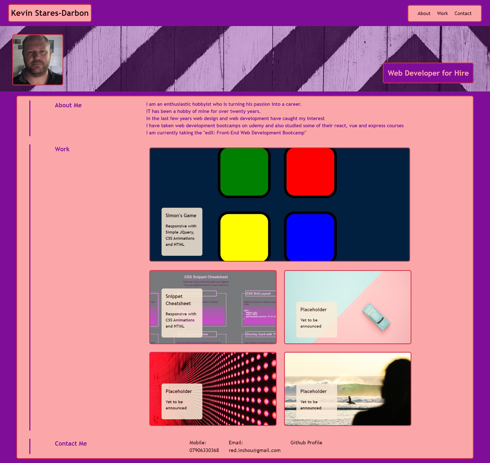
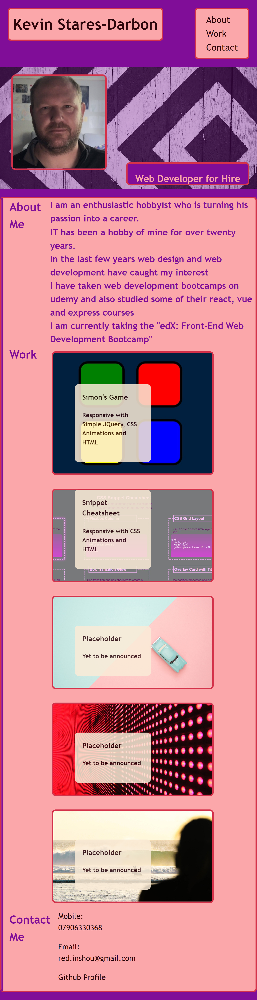

# KS-D_Profile

## Description

I have authored this webpage so that it can serve as a home for my professional portfolio and profile.

I want to have the design and content showcase my proficiency in web-development.

This project helps me to control the look and content of my online profile.

Whilst doing this project I learned how tricky it can be to use media queries to make the content responsive to all viewing devices.

## Table of Contents

Included for your ease of use is a table of contents

- [Installation](#installation)
- [Usage](#usage)
- [Credits](#credits)
- [Screenshots](#screenshots)
- [License](#license)

## Installation
  
If you wish to work on the files for this project you can clone it onto your machine and drag the index.html in your browser's url bar to open it using the file protocol.  
  
```Git clone command```  
```
git clone git@github.com:kevinstaresdarbon/KS-D_Profile.git  
```
  
if you simply wish to view the page you can use this link:  
[KS-D_Profile](https://kevinstaresdarbon.github.io/KS-D_Profile/)

## Usage
  
This webpage constitutes my profile and contains my image, my name, links to my work and links with which to contact me.  
  
If you are interested in my work please contact me using the links provided.  
  
## Credits
  
The starter code at the initial starter commit, including the image files, HTML and CSS, was provided by the staff of edX.  
All commits after that is original work done by myself.  
No collaboration was needed or taken on this repository and code.  
  
I used [colormind.io](http://colormind.io/) to develop the theme colors for this website  
  
I used <https://www.icongeneratorai.com/> to generate the favicon png  
  
The template and advice for this README was taken from this site:  
<https://coding-boot-camp.github.io/full-stack/github/professional-readme-guide>  
  
## Screenshots  
  
Below are the screenshots of the website at different resolutions:  
  
Above 1200px wide:  
  
  
Between 768 and 1199 pixels wide:  
  
  
between 360 and 767 pixels wide:  
  
  
360 pixels:  
  
  
## License  
  
MIT License citation is supplied [HERE](./LICENSE)

